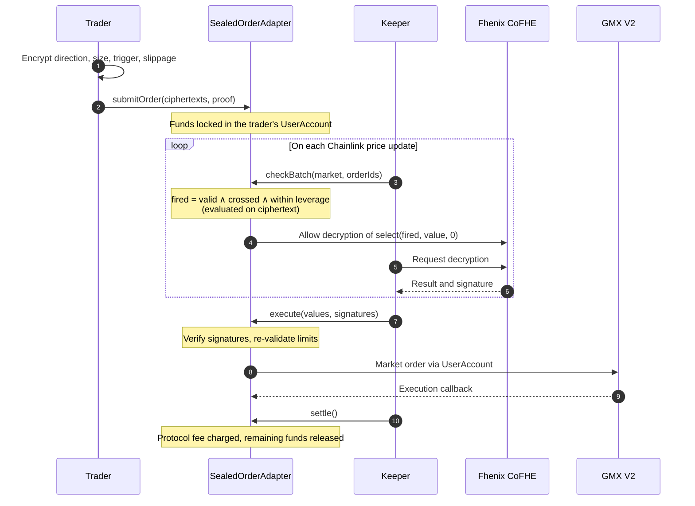
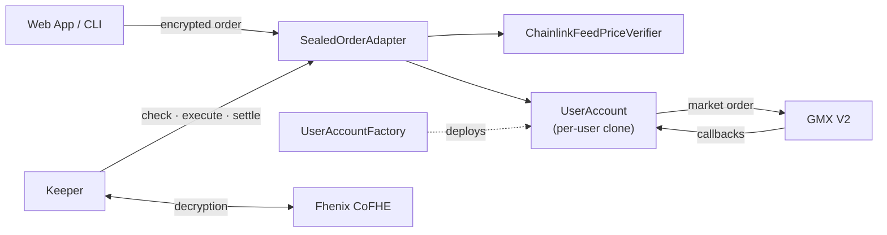

<div align="center">


# fheMX

### Trade on GMX without showing your hand

Limit entries, stop-losses, take-profits and **trailing stops** whose trigger, size and direction stay encrypted on-chain until the moment they execute. No one can hunt your stop if no one can see it.


</div>

---

## Table of Contents

- [Why fheMX](#why-fhemx)
- [Overview](#overview)
- [Sealed Trailing Stop](#sealed-trailing-stop)
- [Key Features](#key-features)
- [How It Works](#how-it-works)
- [Privacy Model](#privacy-model)
- [Architecture](#architecture)
- [Deployments](#deployments)
- [Getting Started](#getting-started)
- [Usage](#usage)
- [Fee Model](#fee-model)
- [Testing](#testing)
- [Technology Stack](#technology-stack)

---

## Why fheMX

On a public perp exchange, every conditional order you place is information handed to the rest of the market. Bots read the order book, see where the stops cluster, and push the price there. fheMX keeps that information sealed.

| If you are… | fheMX gives you |
|---|---|
| **A trader tired of being stopped out by wicks** | Stops that can't be targeted, because their price is never published |
| **Running a strategy you don't want copied** | Size, side and entry levels that stay encrypted until execution |
| **Trading size** | No visible limit orders for others to front-run or fade |
| **Riding a trend** | A sealed trailing stop that locks in profit as the price moves, with a distance nobody else can see |

**What you keep:**
- **GMX liquidity and execution.** Orders fill as ordinary GMX V2 market orders, against the same pools and the same prices.
- **Self-custody.** Funds sit in your own account contract. Only you can withdraw. No admin keys, no upgrades, no pause switch.
- **No trusted operator.** Keepers run the checks without ever learning your trigger. Anyone can run one.
- **A normal trading experience.** A web app with an order ticket, position protection buttons and an order history you can decrypt with your own wallet.

---

## Overview

### Motivation

Conditional orders on on-chain perpetual exchanges are fully transparent. Once an order is placed, its trigger price, size and direction are visible to every market participant. This exposes traders to:

- **Stop hunting:** adversarial price movement aimed at clusters of visible stop-losses.
- **Front-running:** trading ahead of known limit entries.
- **Position profiling:** copy trading, or trading against, large and predictable participants.

### Solution

fheMX is a privacy layer for GMX V2 built on [Fhenix CoFHE](https://www.fhenix.io/) fully homomorphic encryption (FHE). Order parameters are encrypted on the client before submission. The smart contract evaluates the trigger condition directly on ciphertext, and nothing is decrypted while the condition is unmet. When an order triggers, only the values needed for execution are revealed, and the order is placed on GMX V2 as a standard market order.

| Parameter | Standard GMX order | fheMX sealed order |
|---|---|---|
| Trigger price | Public | Encrypted, never revealed |
| Position size | Public | Encrypted until execution |
| Direction (long / short) | Public | Encrypted until execution |
| Slippage tolerance | Public | Encrypted until execution |
| Information per price check | Full order details | Not yet triggered |
| Trailing-stop distance | Public | Encrypted, never decrypted |
| Execution venue | GMX V2 | GMX V2 |

---

## Sealed Trailing Stop

A trailing stop follows the price up and fires when it pulls back by a set percentage: it caps your loss and locks in your profit in one order. On a public exchange the trail is visible, so anyone can calculate exactly where your stop sits. In fheMX the trail is encrypted, and the contract compares against it on every price update without ever decrypting it.

**Example: long ETH with a sealed 5% trail**

```
ETH price:   2400 → 2500 → 2600 → 2550 → 2470
Highest:     2400   2500   2600   2600   2600
Stop (−5%):  2280   2375   2470   2470   2470   ← fires at 2470
```

A fixed stop at 2280 would have handed back the whole rally. The trailing stop moved up with the price and closed the position 5% below the top.

**How it works on ciphertext:** the contract tracks the highest and lowest checked price (public, since they come from the oracle) and tests

```
long:   price × 10000  ≤  highest × (10000 − trailBps)
short:  price × 10000  ≥  lowest  × (10000 + trailBps)
```

with the trail and the side encrypted. There's no division and no decryption; each check reveals only "fired" or "not yet". When it fires, the position closes on GMX like any other fheMX stop, with the same trimming, retry and settlement.

> Only FHE makes this possible. A trailing stop's trigger changes on every price update, so it can't be a one-time hidden commitment: the contract has to compare live prices against a secret it never sees.

---

## Key Features

### Privacy
- **Encrypted trigger evaluation:** the trigger condition is computed on ciphertext using FHE operations (`FHE.lte`, `FHE.gte`, `FHE.select`). The trigger price is never decrypted.
- **Non-revealing checks:** each evaluation publishes `select(fired, value, 0)`, so an order that has not triggered decrypts to zeros.
- **Encrypted intake validation:** size, slippage and trigger limits are enforced homomorphically. The result is an encrypted flag readable only by the order owner, which prevents parameter probing.
- **Owner-only visibility:** owners can decrypt their own order parameters at any time using a signed permit.

### Custody and Security
- **Isolated user accounts:** each user operates through a dedicated `UserAccount` contract (EIP-1167 clone). It serves as the GMX `account`, `receiver` and `callbackContract`, so collateral, proceeds and refunds always return to the user.
- **Restricted adapter permissions:** the adapter can only lock funds for an order and submit it to GMX. Withdrawals are owner-only.
- **Immutable configuration:** markets, limits, fees and oracles are fixed at deployment, with no admin, pause or upgrade path.
- **Verified decryption:** revealed values require valid CoFHE signatures (`FHE.publishDecryptResult`) and are re-validated against public size, slippage and leverage limits before funds move.
- **Replay protection:** encrypted inputs are bound to the submitting address and the adapter contract.
- **Fired-check expiry:** a triggered evaluation is executable only within `maxReportAge`, preventing execution at stale prices.
- **Deterministic reconciliation:** one adapter order per GMX position may be in flight at a time, so every outcome is resolvable from position state.
- **Balance accounting:** free and locked balances are tracked per order, with reentrancy protection on all fund movements.

### Execution on GMX V2
- **Native GMX orders:** triggered orders execute as standard GMX V2 market orders against GMX liquidity.
- **Impact-aware pricing:** the acceptable price is derived from GMX's execution-price estimate (`Reader.getExecutionPrice`), bounded by the sealed slippage tolerance.
- **Automatic retry:** orders cancelled by GMX are re-armed once using the owner's fallback slippage.
- **Callback recovery:** `reconcile` resolves order outcomes from GMX state if a callback is not delivered.

### Decentralised Operation
- **Permissionless keepers:** any participant can operate the checker that evaluates, executes and settles orders.
- **Self-funding evaluation:** each check is paid from the order's own check budget, compensating keepers for gas.
- **Oracle safeguards:** Chainlink Data Feeds with per-feed staleness limits and L2 sequencer-uptime validation.

### Supported Markets

| Market | Collateral | Order Types |
|---|---|---|
| ETH / USD | ETH, USDC | Limit entry, stop-loss, take-profit, trailing stop |
| BTC / USD | BTC, USDC | Limit entry, stop-loss, take-profit, trailing stop |

---

## How It Works



### Order Lifecycle

1. **Submit:** the trader encrypts the order parameters with `@cofhe/sdk` and submits them with a single input proof. The required collateral, execution fees and check budget are locked in the trader's account.
2. **Evaluate:** on every oracle update, a keeper calls `checkBatch`. The contract computes the trigger condition on ciphertext and exposes only `select(fired, value, 0)` for decryption.
3. **Execute:** once a check decrypts to non-zero values, the keeper submits the signed decryption. The contract verifies it, re-validates all public limits and places the order on GMX.
4. **Settle:** after GMX confirms execution, the protocol fee is charged and all unused funds are released to the trader's free balance.

---

## Privacy Model

| Stage | Publicly Visible |
|---|---|
| Order submission | Market, order type, collateral token and amount, execution fee, fallback slippage |
| Each evaluation | Evaluation price and timestamp; for a trailing stop, the highest and lowest checked price |
| Order execution | Size, direction and slippage (required by GMX) |
| At no point | Trigger price; trailing-stop distance |

Every evaluation follows an identical execution path regardless of the encrypted values, so no information leaks through control flow.

**Honest limits.** A stop-loss, take-profit or trailing stop protects a GMX position, and positions are public, so its side and size can be inferred from the position. For a trailing stop, the fire price together with the public high/low mark reveals the trail in hindsight; before it fires, the stop level is never revealed.

---

## Architecture



### Smart Contracts

| Contract | Responsibility |
|---|---|
| `SealedOrderAdapter` | Order intake, encrypted trigger evaluation (fixed and trailing), execution, retry and settlement |
| `UserAccount` | Per-user custody, fund locking, GMX order submission and callback handling |
| `UserAccountFactory` | Deterministic deployment of user accounts |
| `ChainlinkFeedPriceVerifier` | Normalised oracle prices with staleness and sequencer checks |

### Repository Structure

```
fheMX/
├── contracts/     Solidity contracts, deployment scripts, unit and fork tests (Foundry)
├── frontend/      Web application: trading, order management, account (Next.js)
├── checker/       Permissionless keeper service (TypeScript)
├── client/        Command-line interface (TypeScript)
├── shared/        Shared library: configuration, clients, ABIs, fixed-point helpers
├── config/        Network addresses and deployment parameters
└── deployments/   Deployed contract addresses
```

---

## Deployments

**Arbitrum Sepolia** (chain ID 421614)

| Contract | Address |
|---|---|
| SealedOrderAdapter | [`0x70971d34B3EC574464706aa7eEbea4644bAAa687`](https://sepolia.arbiscan.io/address/0x70971d34B3EC574464706aa7eEbea4644bAAa687) |
| UserAccountFactory | [`0x657aad5926922D59c679D45DF3F9330B3625eeEd`](https://sepolia.arbiscan.io/address/0x657aad5926922D59c679D45DF3F9330B3625eeEd) |
| UserAccount (implementation) | [`0x69DFE8Abd2a65F543892b1105f2689E325a3E11C`](https://sepolia.arbiscan.io/address/0x69DFE8Abd2a65F543892b1105f2689E325a3E11C) |
| ChainlinkFeedPriceVerifier | [`0x76cf60c777456F1593b295B71CD9027A86aD33af`](https://sepolia.arbiscan.io/address/0x76cf60c777456F1593b295B71CD9027A86aD33af) |

> **Testnet liquidity:** GMX's Arbitrum Sepolia pools have limited open-interest capacity. If GMX cancels an order with `InsufficientReserveForOpenInterest`, that side of the market is full; try the other side, a smaller size, or the other market.

---

## Getting Started

### Prerequisites

- [Foundry](https://book.getfoundry.sh/) 1.0 or later
- Node.js 24
- pnpm 10

### Installation

```sh
git clone https://github.com/yashsharma22003/fheMX.git
cd fheMX
pnpm install
```

### Configuration

Create a single `.env` file at the repository root:

```sh
cp .env.example .env
```

| Variable | Description | Required |
|---|---|---|
| `ARBITRUM_SEPOLIA_RPC_URL` | RPC endpoint (defaults to the public Arbitrum Sepolia endpoint) | No |
| `PRIVATE_KEY` | Deployer and CLI wallet | For deployment and CLI |
| `CHECKER_PRIVATE_KEY` | Keeper wallet, funded with Sepolia ETH | For the keeper |
| `FEE_COLLECTOR` | Protocol fee recipient (defaults to the deployer) | No |

Load the environment into the current shell before running the keeper, CLI or deployment scripts:

```sh
set -a && . ./.env && set +a
```

### Running

```sh
pnpm web                  # Web application at http://localhost:3000
pnpm -F checker start     # Keeper service
```

### Deployment

```sh
cd contracts

# Simulate against a fork
forge script script/Deploy.s.sol --fork-url $ARBITRUM_SEPOLIA_RPC_URL

# Broadcast (writes deployments/arbitrum-sepolia.json)
BROADCAST=true forge script script/Deploy.s.sol --rpc-url $ARBITRUM_SEPOLIA_RPC_URL --broadcast
```

After deploying, run `pnpm abis` to regenerate the ABIs and deployment metadata used by the TypeScript packages.

---

## Usage

### Web Application

The web application provides order placement, order tracking with owner-side decryption, account funding and withdrawals. Orders are encrypted in the browser before submission. Each open position has one-click **Sealed stop-loss**, **Take-profit** and **Trailing stop** buttons, and a trailing stop's order page shows its live high/low mark and, once you unlock it, your current stop level.

### Command-Line Interface

```sh
# Fund the trading account
pnpm -F client cli fund 0.05

# Sealed limit entry: long $100 at $2,400 with 1% slippage
pnpm -F client cli order --kind limit --side long --size 100 --trigger 2400 --slippage 100 --collateral 0.02

# Sealed stop-loss on an existing long position
pnpm -F client cli order --kind stop --side long --size 100 --trigger 2300 --slippage 100

# Sealed trailing stop: close the long once ETH falls 5% from its highest checked price
pnpm -F client cli order --kind trail --side long --size 100 --trail 5 --slippage 100

# BTC market with USDC collateral
pnpm -F client cli fund-token USDC_SG 50
pnpm -F client cli order --market BTC_USD --collateral-token USDC_SG --collateral 50 --side long --size 100 --trigger 80000

# Order management (status shows a trailing stop's high/low mark)
pnpm -F client cli status 1
pnpm -F client cli topup 1 0.001
pnpm -F client cli cancel 1
```

### Available Scripts

| Command | Description |
|---|---|
| `pnpm build` | Compile contracts |
| `pnpm test` | Run unit tests |
| `pnpm test:fork` | Run fork tests against Arbitrum Sepolia |
| `pnpm typecheck` | Typecheck all TypeScript packages |
| `pnpm abis` | Regenerate ABIs and deployment metadata |
| `pnpm web` | Start the web application |
| `pnpm web:build` | Production build of the web application |

---

## Fee Model

| Fee | Amount | Recipient |
|---|---|---|
| Check fee | 0.00005 ETH per evaluation, drawn from the order's check budget | Keeper (90%), fee collector (10%) |
| Protocol fee | 10 bps of position size for limit entries; flat fee for stop-loss, take-profit and trailing stop. Charged only on successful execution | Fee collector |
| Execution fee | Two GMX execution fees reserved per order (initial attempt and one retry); unused fees are returned | GMX keepers |

The protocol fee reserve is derived solely from public values (collateral × maximum leverage), so locked amounts reveal nothing about the encrypted position size. Amounts shown are the Arbitrum Sepolia configuration.

A trailing stop only moves when it's checked, so fund its check budget for as long as you want it to trail; unused budget is returned.

---

## Testing

```sh
pnpm test          # Unit tests
pnpm test:fork     # Fork tests against Arbitrum Sepolia
```

| Suite | Scope |
|---|---|
| Unit (157 tests) | Encrypted intake validation, trigger logic for every order type and direction (including trailing-stop ratcheting, reversal and overflow bounds), leverage limits, check fees, retry, check expiry, reconciliation and recovery. Runs on CoFHE mock contracts. |
| Fork (29 tests) | End-to-end lifecycles against the live GMX V2 deployment on an Arbitrum Sepolia fork, covering limit entries, stop-losses, trailing stops and BTC/USDC orders through execution and settlement. |

---

## Technology Stack

| Layer | Technology |
|---|---|
| Smart contracts | Solidity 0.8.25, Foundry, OpenZeppelin 5.4 |
| Encryption | Fhenix CoFHE (`@cofhe/sdk` 0.7.1, `@fhenixprotocol/cofhe-contracts` 0.2.0) |
| Trading protocol | GMX V2 (interfaces pinned to `gmx-synthetics` @ `bf30ebb`) |
| Oracles | Chainlink Data Feeds |
| Frontend | Next.js 16, React 19, wagmi, viem, RainbowKit |
| Keeper and CLI | TypeScript, Node.js 24, viem |

CoFHE packages are pinned and should be upgraded together. GMX interfaces match the commit referenced by GMX's Arbitrum Sepolia deployment; see [`contracts/src/interfaces/gmx/README.md`](contracts/src/interfaces/gmx/README.md).
