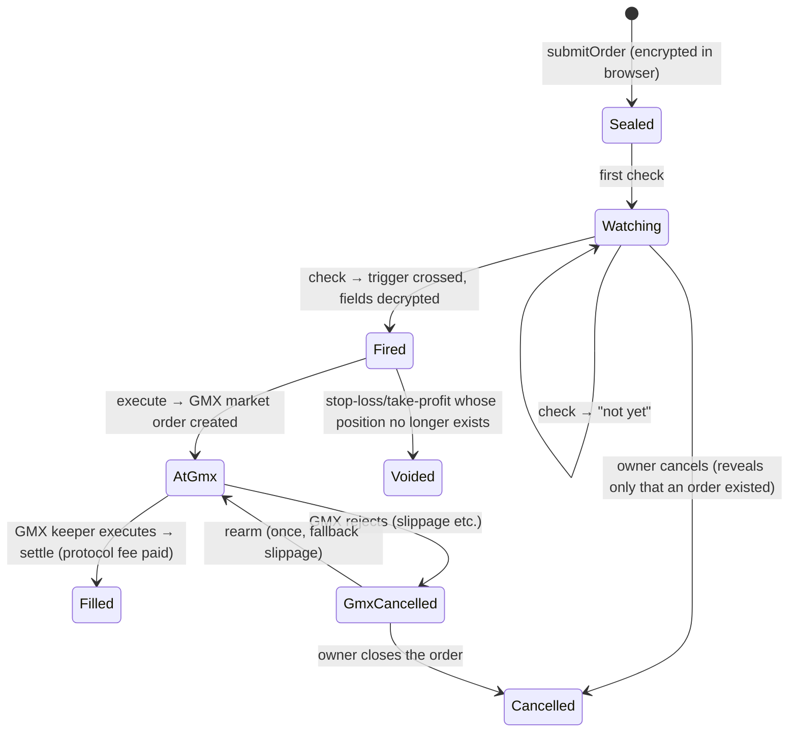

# Frontend context: Sealed Order Privacy Layer for GMX

> **For whoever builds the frontend.** This file is the full brief: what the product is, how it works on-chain, every contract call and data shape you need, and the screens to build. Treat the contract interface sections as exact; everything under "Product and UX" is direction you can refine. Where something is marked **unverified**, check it against the named source file before relying on it.

---

## 1. The product in one paragraph

A privacy layer for **GMX V2 perpetuals** on Arbitrum. Users place **limit entries, stop-losses and take-profits whose side, size, trigger price and slippage are encrypted** (Fhenix CoFHE, fully homomorphic encryption) before they leave the browser. While an order rests, nobody (bots, copy traders, the chain) can read its trigger or size. A permissionless **checker** re-evaluates each order on every Chainlink price update *on encrypted data*; only when the trigger is crossed are the order's size, side and slippage decrypted and a real GMX market order placed. The trigger price itself is never decrypted. Cancelling reveals only that an order existed.

**Honest positioning (keep this tone):** "Verifiable and keyless privacy for your GMX orders." It is *not* faster or cheaper than trading natively on GMX: triggers react on price-feed updates (seconds to minutes), and fees are added on top of GMX's own.

**Current stage:** live on **Arbitrum Sepolia testnet** (chain id `421614`). Present it as a working testnet product / demo.

---

## 2. Glossary

| Term | Meaning |
| --- | --- |
| **Sealed order** | An order whose sensitive fields are encrypted (FHE ciphertext handles on-chain). |
| **Adapter** | `SealedOrderAdapter` contract: accepts sealed orders, runs encrypted trigger checks, places GMX orders. |
| **Account** | A per-user smart-contract wallet (`UserAccount`, a minimal proxy) created by the adapter on the user's first order. It holds the user's collateral and is the GMX account for their positions. Only the owner can withdraw. |
| **Checker** | An off-chain bot (anyone can run it; the product runs one) that calls `checkBatch`, decrypts results and calls `execute` / `settle` / `rearm`. Users never need to run it. |
| **Check** | One encrypted evaluation of an order against the current Chainlink price. Reveals only "fired" or "not yet". |
| **Check budget** | ETH locked per order to pay for checks. Each check costs `checkFee` (0.00005 ETH on Sepolia). When the budget runs out the order stops being checked until topped up. |
| **Fire** | A check where the trigger was crossed (and caps passed). The order's size, side and slippage become public; a GMX order is created. |
| **Re-arm** | If GMX cancels a fired order (e.g. price moved past the slippage bound), anyone can re-submit it **once** with the user's wider public *fallback slippage*. |
| **Collateral token** | For a limit entry: a token from the market's pool (WETH on ETH/USD, BTC on BTC/USD, or USDC.SG on either). WETH is held as native ETH. |
| **Index token** | The asset a market tracks (ETH or BTC); its Chainlink price decides triggers. |
| **CoFHE** | Fhenix's FHE coprocessor. Encryption happens in the browser via `@cofhe/sdk`; decryption is done by Fhenix's decryption service. |

---

## 3. How an order moves (the lifecycle the UI must show)



Typical live timing on Sepolia (measured 2026-09-30): the Chainlink ETH/USD feed updates every 30–120 s; a check confirms in ~3.5 s; decryption ~0.6–1.0 s per value; execute ~3.7 s; GMX keepers fill within ~15 s. From a fresh price update crossing the trigger to a filled position: ~20–40 s.

### Deriving the UI state

Read three things per order: `adapter.orderOf(id).status`, `adapter.checkOf(id)`, and (once fired) `account.outcomeOf(id)` plus `adapter.fillOf(id)`.

| `orderOf.status` | Other data | UI state |
| --- | --- | --- |
| `1` Open | `checkOf.lastCheckAt == 0` | **Sealed** (waiting for first check) |
| `1` Open | `lastCheckAt > 0` | **Watching** (show check count, last check time, last check price) |
| `3` Fired | `outcomeOf` = `1` Pending | **At GMX** (waiting for keeper) |
| `3` Fired | `outcomeOf` = `2` Executed | **Filled, settling** (checker will call `settle` shortly) |
| `3` Fired | `outcomeOf` = `3` Cancelled or `4` Frozen, `fillOf.rearmed == false` | **Rejected by GMX, re-arming** |
| `3` Fired | same, `fillOf.rearmed == true` | **Rejected twice**: owner should close (cancel) it |
| `4` Filled | — | **Filled** (final) |
| `2` Cancelled | an `OrderVoided` event exists for it | **Voided** (position was gone) |
| `2` Cancelled | otherwise | **Cancelled** |

Check count: count `OrderChecked` events for the order id.

---

## 4. What stays hidden (the core message)

| Field | On-chain | Revealed |
| --- | --- | --- |
| Side (long/short) | encrypted | only when the order fires |
| Size (USD) | encrypted | only when it fires |
| Trigger price | encrypted | **never decrypted**; after a fire, observers only know it was crossed between the previous and the firing check price |
| Slippage | encrypted | when it fires |
| Market, order type (limit / stop / TP) | public | at submission |
| Collateral amount and token, execution fee, check budget, fallback slippage | public | at submission |
| That an order exists, when it is checked, the price it was checked at | public | as it happens |
| Result of each non-firing check | public: "not yet" only | — |

For stop-loss / take-profit, side and size are largely inferable from the user's existing public GMX position; the **trigger** is what's truly hidden. For limit entries, side, size and trigger are all hidden. Say this plainly in the UI.

---

## 5. Tech stack and constraints

- **Framework:** React + TypeScript, Vite (or Next.js App Router with client components for all wallet/FHE code). New folder `web/` in the monorepo (pnpm workspace; add `web` to `pnpm-workspace.yaml`).
- **Wallet / chain:** `wagmi` v2 + `viem` **2.38.6** (pin; matches the repo) + RainbowKit (or ConnectKit). Chain: `arbitrumSepolia` from `viem/chains`.
- **FHE:** `@cofhe/sdk` **0.7.1**, browser entry `@cofhe/sdk/web` (uses Web Workers for ZK proofs; keys cached in IndexedDB). Chains from `@cofhe/sdk/chains` (`arbSepolia`). Keep all `@cofhe/*` at 0.7.1.
- **Styling:** your choice (Tailwind + shadcn/ui fits). Dark trading-terminal look by default.
- **Charts:** a lightweight candlestick/line chart (e.g. TradingView Lightweight Charts). Price source: poll the Chainlink feed (see §8); optional GMX price API if available.
- **No backend required** for the core app: everything is on-chain reads, wallet writes and the CoFHE SDK. The checker is a separate process (`checker/`), not part of the web app.
- **Never** send plaintext order fields to any server, log them, or put them in analytics. Encryption happens in the browser.

### Reuse from the repo

| Path | What | Browser-safe? |
| --- | --- | --- |
| `shared/src/abis.ts` | `sealedOrderAdapterAbi`, `userAccountAbi`, `chainlinkFeedPriceVerifierAbi`, `aggregatorV3Abi` as `as const` (full viem typing). Generated from the contracts; regenerate with `pnpm abis`. | Yes |
| `shared/src/units.ts` | `toSizeUsd6`, `toPrice8`, `fromPrice8`, `OrderKind`, `Status`, `GmxOutcome` | Yes |
| `shared/src/config.ts` | Node-only (reads files with `fs`). **Don't import in the browser**; import the JSON files below directly instead. | No |
| `config/networks/arbitrum-sepolia.json` | GMX addresses, markets and their tokens, token decimals, Chainlink feeds, adapter parameters | Yes (import JSON) |
| `deployments/arbitrum-sepolia.json` | Live adapter, factory, verifier, account implementation addresses | Yes (import JSON) |
| `client/src/cli.ts` | A working Node CLI doing every user action (fund, order, status, topup, cancel, withdraw). **Use it as the reference implementation** for call shapes. | Pattern only |

> **Deployment/ABI version note.** `shared/src/abis.ts` matches the current contract code, including the per-order **check budget** (`checkBudget` field, `topUpCheckBudget`). The current deployment in `deployments/arbitrum-sepolia.json` is v3 (adapter `0x683f2d0E8943424865f3A6f363454e7de649D4a3`), built from that code. Always read addresses from `deployments/arbitrum-sepolia.json`; don't hardcode them.

---

## 6. Network, markets and tokens (Arbitrum Sepolia)

From `config/networks/arbitrum-sepolia.json`:

| Market (config key) | GMX market token | Index | Long token | Short token |
| --- | --- | --- | --- | --- |
| `ETH_USD` | `0xb6fC4C9eB02C35A134044526C62bb15014Ac0Bcc` | WETH | WETH | USDC.SG |
| `BTC_USD` | `0x3A83246bDDD60c4e71c91c10D9A66Fd64399bBCf` | BTC | BTC | USDC.SG |

| Token (config key) | Address | Decimals | Notes |
| --- | --- | --- | --- |
| `WETH` | `0x980B62Da83eFf3D4576C647993b0c1D7faf17c73` | 18 | GMX's wrapped native token. **The account holds it as native ETH**: fund with a plain ETH transfer, use this address as `collateralToken` for ETH collateral. |
| `BTC` | `0xF79cE1Cf38A09D572b021B4C5548b75A14082F12` | 8 | GMX test token |
| `USDC_SG` | `0x3253a335E7bFfB4790Aa4C25C4250d206E9b9773` | 6 | Stargate USDC; fund with an ERC20 `transfer` to the account |

Chainlink Data Feeds (8 decimals, free to read): ETH/USD `0xd30e2101a97dcbAeBCBC04F14C3f624E67A35165`, BTC/USD `0x56a43EB56Da12C0dc1D972ACb089c06a5dEF8e69`, USDC/USD `0x0153002d20B96532C639313c2d54c3dA09109309`.

Adapter parameters (config `adapter` section; also readable on-chain as public immutables): min size $10 (`minSizeUsd6`), max size $100,000, max slippage 500 bps, max fallback slippage 1,000 bps, max leverage 10×, protocol fee 10 bps on limit-entry fills, decrease fee 0, min execution fee 0.0005 ETH, check fee 0.00005 ETH (10% spread), min check interval 10 s.

Faucets for Sepolia ETH to link in the UI: Alchemy, QuickNode or `faucets.chain.link` (Arbitrum Sepolia), or bridge Sepolia ETH at `bridge.arbitrum.io`.

---

## 7. Units and conversions (get these exactly right)

| Quantity | Format | Example |
| --- | --- | --- |
| Encrypted **size** | USD with 6 decimals, `uint64` | $100 → `100_000000n` (`toSizeUsd6(100)`) |
| Encrypted **trigger price** | USD with 8 decimals, `uint64` | $2,400 → `240000000000n` (`toPrice8(2400)`) |
| Encrypted **slippage** | basis points, `uint32` | 1% → `100` |
| Chainlink / verifier prices | USD with 8 decimals | `price8 / 1e8` |
| Collateral amount | token's smallest unit | 0.005 ETH → `5000000000000000n`; 50 USDC → `50000000n` |
| GMX `sizeDeltaUsd` (in `fillOf`) | USD with 30 decimals | `sizeDeltaUsd / 1e30` |
| GMX prices (`acceptablePrice`) | USD per smallest token unit, 30 decimals: `price8 × 10^(22 − decimals)` | ETH (18 dec): `price8 × 1e4`; BTC (8 dec): `price8 × 1e14`; USDC (6 dec): `price8 × 1e16` |
| Order id | `bytes32` of a counter | order 7 → `pad(toHex(7n), { size: 32 })` |

---

## 8. Contract interface reference

All ABIs are in `shared/src/abis.ts`. Addresses: `adapter` from `deployments/arbitrum-sepolia.json`; a user's account from `adapter.accountOf(owner)`.

### 8.1 Adapter: user actions

**`submitOrder(SealedOrderInput input) returns (bytes32 orderId)`**, sent by the user's wallet (the encryption proof is bound to this sender and to the adapter address).

```ts
type SealedOrderInput = {
  market: Address;              // GMX market token (see §6)
  kind: 0 | 1 | 2;              // 0 LimitIncrease, 1 StopLoss, 2 TakeProfit
  collateralToken: Address;     // limit entry: a pool token of the market; stop/TP: the collateral token of the position being reduced
  collateral: bigint;           // limit entry: > 0, in collateralToken units; stop/TP: must be 0
  executionFee: bigint;         // ETH wei per GMX attempt, >= minExecutionFee (0.0005 ETH); 2 are locked (first try + re-arm)
  fallbackSlippageBps: number;  // public, used only by a re-arm; <= maxFallbackSlippageBps (1000)
  checkBudget: bigint;          // ETH wei for checks, >= checkFee (current code; see §5 version note)
  isLong: Hex;                  // encrypted handle (bool)      ┐
  sizeUsd6: Hex;                // encrypted handle (uint64)    │ from ONE encryptInputs batch,
  triggerPrice8: Hex;           // encrypted handle (uint64)    │ in exactly this order
  slippageBps: Hex;             // encrypted handle (uint32)    ┘
  inputProof: Hex;              // the batch's single proof
};
```

Before submitting, the user's **account must already hold** the collateral, `2 × executionFee` and `checkBudget` (plus the protocol-fee reserve for limit entries: `adapter.maxProtocolFee(collateral)`, in the collateral token), all as **free** balance. The account is created automatically on the first order; it can be funded at its predicted address (`accountOf(owner)`) before it exists.

Reserve maths for the order ticket's "you need" line (limit entry with ETH collateral):
`collateral + maxProtocolFee(collateral) + 2 × executionFee + checkBudget` ETH.
With USDC collateral: `collateral + maxProtocolFee(collateral)` USDC **and** `2 × executionFee + checkBudget` ETH.
Stop-loss / take-profit: `2 × executionFee + checkBudget + decreaseFeeFlat` ETH.

**`cancelOrder(bytes32 orderId)`**, owner only. Works while Open, or when Fired and GMX cancelled it. Frees everything locked for the order.

**`topUpCheckBudget(bytes32 orderId, uint256 amount)`**, owner only, while Open. Moves `amount` ETH of the account's free balance into the order's check budget.

### 8.2 Adapter: reads

| Function | Returns |
| --- | --- |
| `accountOf(address owner)` | the owner's account address (deterministic, valid before creation) |
| `orderOf(bytes32 id)` | `{ owner, account, market, kind, status, collateralToken, collateral, fallbackSlippageBps, isLong, sizeUsd6, triggerPrice8, slippageBps, intakeValid }`; the last five are **ciphertext handles** (`bytes32`) |
| `checkOf(bytes32 id)` | `{ lastCheckAt, lastReportTimestamp, checkPrice8, collateralPrice8, revealedSize, revealedIsLong, revealedSlippage }` |
| `fillOf(bytes32 id)` | `{ sizeDeltaUsd, size6, isLong, slippage, acceptablePrice, protocolFee, gmxKey, rearmed }` (zeros until fired) |
| `marketOf(address market)` | `{ indexToken, longToken, shortToken, indexDecimals, longDecimals, shortDecimals }` |
| `isSupportedMarket(address market)` | bool |
| `orderCount()` | total orders ever (ids are `1..orderCount`) |
| `maxProtocolFee(uint256 collateral)` | protocol-fee reserve for a limit entry, in collateral units |
| Public parameters | `minSizeUsd6`, `maxSizeUsd6`, `maxSlippageBps`, `maxFallbackSlippageBps`, `maxLeverage`, `increaseFeeBps`, `decreaseFeeFlat`, `minExecutionFee`, `checkFee`, `checkFeeSpread`, `minCheckInterval`, `maxReportAge`, `priceVerifier`, `wnt`, `factory` |

Enums: `status` 0 None, 1 Open, 2 Cancelled, 3 Fired, 4 Filled. `kind` 0 LimitIncrease, 1 StopLoss, 2 TakeProfit.

### 8.3 Adapter events (for order lists, timelines and activity feeds)

```solidity
event OrderSealed(bytes32 indexed orderId, address indexed owner, address indexed account, address market, uint8 kind, uint256 collateral, uint256 executionFee, uint256 protocolFeeReserve);
event OrderChecked(bytes32 indexed orderId, uint256 price8, uint256 reportTimestamp);
event OrderFired(bytes32 indexed orderId, bytes32 indexed gmxKey, uint256 sizeDeltaUsd, bool isLong, uint256 acceptablePrice, uint256 protocolFee);
event OrderRearmed(bytes32 indexed orderId, bytes32 indexed gmxKey, uint256 sizeDeltaUsd, uint256 acceptablePrice);
event OrderFilled(bytes32 indexed orderId, uint256 protocolFee);
event OrderVoided(bytes32 indexed orderId);
event OrderCancelled(bytes32 indexed orderId);
event CheckBudgetToppedUp(bytes32 indexed orderId, uint256 amount);
```

A user's orders: `getLogs(OrderSealed, { args: { owner } })` from the deployment block. Public RPCs cap log ranges; page in chunks of ≤ 9,000 blocks, or keep a cursor. The deployment's L2 block is in `contracts/broadcast/Deploy.s.sol/421614/run-latest.json` (`receipts[].blockNumber`). On Arbitrum, `block.number` inside contracts is the L1 block, so always use RPC block numbers.

### 8.4 Account (per user; address from `accountOf`)

| Function | Use |
| --- | --- |
| `freeBalance(address token)` | withdrawable balance; use the **WETH address for native ETH** |
| `lockedBalance(address token)` | locked by open orders |
| `lockOf(bytes32 orderId)` | `{ token, collateral, feePerAttempt, attemptsLeft, protocolFeeReserve, checkBudget }`; checks left = `checkBudget / checkFee` |
| `outcomeOf(bytes32 orderId)` | `(outcome, gmxKey)`, outcome 0 None, 1 Pending, 2 Executed, 3 Cancelled, 4 Frozen |
| `positionSizeUsd(address market, address collateralToken, bool isLong)` | current GMX position size (30-decimal USD) held by this account |
| `withdraw(address token, uint256 amount, address to)` | owner only; free balance only |
| `cancelGmxOrder(bytes32 orderId)` | owner only; cancels a fired order still pending at GMX (after GMX's 300 s wait). Prevents re-arm. |
| `closePosition(ClosePositionRequest)` | owner only; manual GMX market decrease: `{ market, collateralToken, isLong, sizeDeltaUsd, collateralDeltaAmount, acceptablePrice, executionFee, callbackGasLimit }`. Blocked while an adapter order is in flight. `acceptablePrice = 0` accepts any price for a long close. |
| `owner()`, `adapter()`, `pendingCount()` | info |

Funding: native ETH, a plain value transfer to the account address. ERC20 (USDC.SG, BTC): `transfer(account, amount)` on the token.

### 8.5 Prices (verifier)

`priceVerifier.price(address token, bytes report)` → `(price8, timestamp)`; pass `"0x"` as report. It reverts if the token's feed is stale (ETH/BTC > 300 s, USDC > 25 h). For charts and the ticket, you can also read the feed directly: `aggregatorV3.latestRoundData()` → `(roundId, answer, startedAt, updatedAt, answeredInRound)`, 8 decimals. `verifier.feedOf(token)` → `(feed, maxAge)`.

### 8.6 Errors to translate into human messages

| Error | Message |
| --- | --- |
| `InsufficientFreeBalance(required, available)` (account) | "Your account needs X more [token]. Deposit first." |
| `CheckBudgetTooLow(budget, checkFee)` | "Check budget must cover at least one check (X ETH)." |
| `ExecutionFeeTooLow(fee, minimum)` | "Execution fee must be at least X ETH." |
| `FallbackSlippageTooHigh` | "Fallback slippage can be at most 10%." |
| `UnsupportedCollateral(token)` | "That token can't be collateral on this market." |
| `UnsupportedMarket` | "Market not supported." |
| `DecreaseTakesNoCollateral` | (bug in the form; stop/TP must send collateral 0) |
| `NotOrderOwner`, `OrderNotOpen` | "This order can't be changed any more." |
| `InvalidSigner(...)` (CoFHE TaskManager) | "Encryption proof rejected: re-encrypt from this wallet and try again." |
| `AdapterOrdersInFlight`, `ManualCloseInFlight` (account) | "Wait for your pending order to settle first." |

Order fields that break the adapter's hidden caps (size < $10 or > $100k, slippage > 5%, zero trigger) **do not revert**: the order is accepted but can never fire, and nothing reveals why. **Validate these in the form before encrypting.**

---

## 9. CoFHE in the browser

**Unverified against a browser build**: the Node equivalents of these calls are verified live (see `client/src/cli.ts` and `shared/src/chain.ts`). Check exact names in `node_modules/@cofhe/sdk/dist/clientTypes-*.d.ts` and `web.d.ts`.

```ts
import { createCofheClient, createCofheConfig } from "@cofhe/sdk/web";
import { arbSepolia } from "@cofhe/sdk/chains";
import { Encryptable, FheTypes } from "@cofhe/sdk";

const cofhe = createCofheClient(createCofheConfig({ supportedChains: [arbSepolia] }));
await cofhe.connect(publicClient, walletClient); // wagmi's viem clients; reconnect on account/chain change

// Seal an order: ONE batch, in this exact order, bound to the adapter.
const [isLong, sizeUsd6, triggerPrice8, slippageBps, inputProof] = await cofhe
  .encryptInputs([
    Encryptable.bool(side === "long"),
    Encryptable.uint64(toSizeUsd6(sizeUsd)),
    Encryptable.uint64(toPrice8(triggerUsd)),
    Encryptable.uint32(BigInt(slippageBps)),
  ])
  .setConsumingContract(adapterAddress)
  .onStep((step) => setEncryptStep(step)) // drive a progress stepper
  .execute();
```

- First encryption downloads FHE keys and builds a ZK proof: expect **several seconds to ~15 s**; later ones are faster (keys cached). Always show a stepper; never block the UI thread (the web build uses workers).
- The proof is bound to the **connected account** and the **adapter address**. If the user switches wallets between encrypting and sending, re-encrypt.

**Showing the owner their own sealed values** ("Unlock my order"): the owner may decrypt their handles with a self-signed permit (ACP):

```ts
await cofhe.acp.getOrCreateSelfACP();   // prompts one signature, cached per chain+account
const size = await cofhe.decryptForView(order.sizeUsd6, FheTypes.Uint64).withACP().execute();     // bigint
const trigger = await cofhe.decryptForView(order.triggerPrice8, FheTypes.Uint64).withACP().execute();
const isLong = await cofhe.decryptForView(order.isLong, FheTypes.Bool).withACP().execute();       // boolean
const slippage = await cofhe.decryptForView(order.slippageBps, FheTypes.Uint32).withACP().execute();
const valid = await cofhe.decryptForView(order.intakeValid, FheTypes.Bool).withACP().execute();   // false = order can never fire
```

Nobody else can do this: the adapter grants decrypt access only to itself and the owner. If `intakeValid` decrypts to `false`, tell the user their order breaks a limit and suggest cancelling.

The **checker** (not the web app) uses `decryptForTx(...).withoutACP()` on the public post-check results. The web app never needs it.

---

## 10. Product and UX

### 10.1 Signature idea: "Your view vs. the public view"

Every order card and the order detail page show two columns:

- **Your view** (after "Unlock"): Long ETH · $100 · trigger $2,400 · 1% slippage.
- **Public view** (what bots see): market ETH/USD, "Limit entry", 0.005 ETH locked, and the four ciphertext handles (`0x9427…`, shortened), with a link to the submit transaction on `https://sepolia.arbiscan.io/tx/<hash>`.

This is the product's main explanation. Make it prominent, animated when an order is first sealed, and reusable in the demo mode.

### 10.2 Screens

1. **Landing.** Headline, the three problems (stop hunting, strategy copying, cancellation signalling), a 3-step "how it works" (encrypt in browser → checked on encrypted data → revealed only when it fires), a trust section (see §10.5), a CTA to launch the app / start the demo.
2. **Trade** (main app).
   - Market picker (ETH/USD, BTC/USD) with a live price from the Chainlink feed and a small chart.
   - **Order ticket** (§10.3).
   - "Your positions" panel: for each market, collateral token and side, `account.positionSizeUsd(...)`; for each, "Add sealed stop-loss / take-profit" and "Close position".
3. **Orders.** List of the user's orders (from `OrderSealed` logs), each with state badge (§3), market, type, public terms, checks done / left, last check price, and the lifecycle timeline (§10.4). Actions: Unlock details, Top up budget, Cancel.
4. **Account.** Account address (with explorer link and "created on first order" note), free vs locked ETH / USDC.SG / BTC, Deposit (ETH transfer; ERC20 transfer), Withdraw (free only). Explain: "Your account is a contract only you control. The adapter can move funds only into your own GMX orders."
5. ~~Transparency / About~~. Dropped on 2026-09-30; the app has Trade, Orders, Account and Settings only. The trust model (§10.5) stays in the docs.
6. **Demo mode** (§10.6).

### 10.3 Order ticket

Fields, in this order:
- **Type:** Limit entry | Stop-loss | Take-profit. Stop / TP are enabled only when the user has a position on the selected market; they preselect that position's side and collateral token, and default size to the full position.
- **Side:** Long | Short (limit entry).
- **Size (USD)**, with helper "min $10 · max $100,000 · max leverage 10×".
- **Trigger price (USD)**, with a helper describing when it fires, e.g. "Buys when ETH ≤ $2,400". Direction rules: limit entry and stop-loss fire at or below the trigger for longs and at or above for shorts; take-profit is the reverse.
- **Slippage (%)**, default 1%, max 5%.
- **Collateral** (limit entry only): token selector (pool tokens of the market) + amount; show effective leverage = size / (collateral × price) and block > 10×.
- **Advanced** (collapsed): fallback slippage (default 8%, max 10%), execution fee (default 0.001 ETH, min 0.0005), **check budget** (default 0.001 ETH).

Live panels next to the form:
- **"Stays sealed" checklist**: ticks for side, size, trigger, slippage as they're filled; greyed "public" items for market, type, collateral, budget.
- **"You need"**: the reserve maths from §8.1, compared with free balances, with a one-click "Deposit the difference".
- **Costs**: GMX's own fees (not computed on-chain here; show "GMX position fee ≈ 0.04–0.06%"), protocol fee 0.10% of size on a limit-entry fill (0 on stop/TP), execution fee (mostly refunded), check fee 0.00005 ETH per check.
- **Budget translation**: "≈ 20 checks. The ETH price feed updates every ~1–2 min on testnet, so this watches for roughly 20–40 minutes if checked on every update." Top-ups are possible later.

Submit flow: validate → encrypt (stepper: *Fetching keys → Encrypting → Generating proof*) → wallet signature → pending tx → success state that animates into the Your-view / Public-view panel and links to the order.

### 10.4 Lifecycle timeline (order detail)

Vertical timeline, one row per event, newest at the bottom, each with time and a transaction link:
Sealed → Checked · "not yet" at $2,688.14 (×N, collapsible) → **Fired** at $2,690.00 · revealed: short, $20, 1% → Sent to GMX · acceptable price → Filled (protocol fee X) / Rejected by GMX → Re-armed → … / Cancelled / Voided.
While Watching, show a live "last checked Ns ago" and the checks-left meter. Warn at ≤ 3 checks left; at 0, show "Not being watched: top up" prominently.

### 10.5 Trust and honesty (show, don't bury)

- Order fields are encrypted in your browser before they're sent; the chain stores only ciphertext.
- Triggers are evaluated on encrypted data by Fhenix CoFHE; only "fired / not yet" is revealed per check.
- **Decryption today is performed by Fhenix's decryption service** (a single TEE operated by Fhenix, with its key split 3-of-6 among partners). A threshold network is planned, not live. Confidentiality relies on it.
- Your funds sit in your own account contract; hard caps (max size, leverage, slippage) are enforced on-chain regardless of decryption.
- Prices come from Chainlink Data Feeds (free, on-chain); GMX executes at its own oracle price.
- Testnet only; not audited.

### 10.6 Demo mode (for presentations)

A guided, step-by-step overlay on the real app (Arbitrum Sepolia):
1. Connect wallet → check network → faucet link if 0 ETH.
2. Deposit 0.02 ETH to your account.
3. Place a sealed **short limit entry** with its trigger a few % **below** the current price (so it fires on the next check), $20, 0.005 ETH collateral. Show the encryption stepper.
4. Split screen: Your view vs Arbiscan's view of the transaction.
5. Show "Watching" with the next feed update countdown; the checker fires it; animate Fired → At GMX → Filled; the position appears.
6. Add a sealed **stop-loss** on the new position with its trigger below the price (fires immediately), and watch it close.
7. Optional: seal an order that won't fire, watch a few "not yet" checks, cancel it, and show that only "an order existed" became public.

Requires a checker to be running (`pnpm -F checker start`), ideally on a different key than the demo wallet (two transactions from one key at once can clash).

### 10.7 Visual direction (defaults, change freely)

Dark terminal aesthetic (near-black background, one accent colour, e.g. violet for "sealed" states and green / red for long / short), monospace for hashes and prices, a lock / seal motif for encrypted values (blurred or masked text that "unseals" on unlock). Name placeholder: **"Sealed"**. Mobile: responsive, but desktop-first.

---

## 11. Limitations to surface in the UI

- Triggers react to Chainlink feed updates, not every tick: a spike that reverses between updates can be missed; fills can lag native GMX by seconds to minutes.
- A check budget that runs out means the order is no longer watched (the chain doesn't stop it; nobody pays to check it).
- The trigger is revealed within a range when the order fires (between the last "not yet" price and the firing price).
- For stop-loss / take-profit, side and size are inferable from your public position.
- GMX may reject a fired order if the price moves past your slippage before a keeper executes it; the protocol re-arms once with your fallback slippage.
- Costs are higher than native GMX (protocol fee + check fees + two escrowed execution fees).
- Testnet, unaudited, single decryption operator (see §10.5).

---

## 12. Data fetching guidance

- Batch reads with viem `multicall` (orders, checks, fills, locks per page).
- Poll every ~5–10 s while an order is Watching / At GMX; subscribe to new blocks otherwise. Refresh on `OrderChecked` / `OrderFired` / `OrderFilled` events.
- Cache `OrderSealed` logs per user in local storage with a block cursor; re-scan from the cursor.
- Feed price for the ticket: `latestRoundData()` on the market's index feed; show "updated Ns ago".
- Explorer links: `https://sepolia.arbiscan.io/tx/<hash>`, `/address/<address>`.

---

## 13. Acceptance checklist

- [ ] Connect wallet on Arbitrum Sepolia; prompt network switch; faucet links when balance is 0.
- [ ] Account panel: predicted account address, free and locked balances (ETH, USDC.SG, BTC), deposit ETH and ERC20, withdraw free balance.
- [ ] Order ticket for all three kinds with client-side validation of every hidden cap (size, slippage, trigger > 0, leverage ≤ 10×) and every public rule (collateral token in pool, execution fee, fallback slippage, budget ≥ one check).
- [ ] Encryption with a visible stepper; single batch in the exact field order; proof bound to the adapter; errors re-encrypt cleanly.
- [ ] Orders list and detail with the derived state (§3), lifecycle timeline, checks done / left, Arbiscan links.
- [ ] "Unlock my order" via a self permit; Your view / Public view panel.
- [ ] Top up budget; cancel order; close position; add sealed stop-loss / take-profit from a position.
- [ ] Human-readable error messages (§8.6).
- [ ] Trust / limitations content (§10.5, §11) reachable from every screen.
- [ ] Demo mode script (§10.6).
- [ ] No plaintext order data leaves the browser except inside the encrypted batch.

---

## 14. Where to look in the repo

| Need | File |
| --- | --- |
| Full design and rationale | `docs/design-v0.2.md`, `docs/decisions.md` |
| Fee model | `docs/fee-model.md` |
| Live-run numbers and addresses | `docs/live-run-2026-09-30.md` |
| Known issues | `docs/KNOWN_ISSUES.md` |
| CoFHE API notes | `docs/integration/cofhe.md` |
| Price feeds | `docs/integration/chainlink-data-feeds.md` |
| Contract source (NatSpec on every function) | `contracts/src/adapter/SealedOrderAdapter.sol`, `contracts/src/account/UserAccount.sol` |
| Working user flows in code | `client/src/cli.ts` |
| Checker behaviour | `checker/src/index.ts` |
